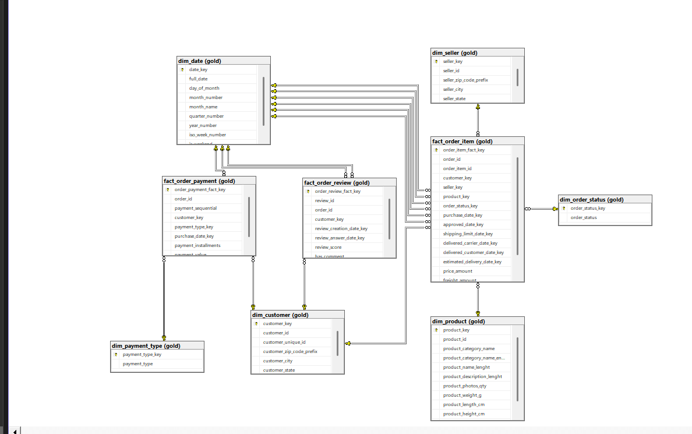

# Brazilian E-Commerce SQL Data Warehouse

An end-to-end **SQL Data Warehouse** project built on top of the **Olist Brazilian E-Commerce Dataset**, using a layered **Bronze / Silver / Gold** architecture to transform raw e-commerce data into analytics-ready dimensional models and dashboard-ready reporting tables.

<p align="center">
  
</p>

## Overview

This project demonstrates how to design and build a complete **e-commerce data warehouse** using SQL-based data modeling, ETL workflows, and dimensional modeling techniques.

The solution covers:

- Raw data ingestion from multiple source files
- Layered transformation using **Bronze**, **Silver**, and **Gold**
- Creation of analytics-ready **dimension** and **fact** tables
- ETL workflow orchestration
- Audit logging for ETL monitoring
- Testing and validation scripts
- Dashboard reporting pages for business analysis
- Visual documentation through schema, mapping, and dashboard screenshots

---

## Architecture

The warehouse follows a **medallion architecture**:

### Bronze Layer
Stores raw ingested data with minimal transformation.

### Silver Layer
Stores cleaned, standardized, and transformation-ready data.

### Gold Layer
Stores curated **dimension** and **fact** tables optimized for business analysis, reporting, and dashboarding.

---

## Dataset

This project is based on the **Olist Brazilian E-Commerce Dataset** and includes source entities such as:

- customers
- geolocation
- orders
- order items
- order payments
- order reviews
- products
- sellers
- product category translations

---

## Data Warehouse Schema

<p align="center">
  
</p>

The warehouse schema is modeled using a **star-schema style dimensional design** to support analytical reporting, KPI tracking, and dashboard development.

---

## Gold Layer Data Model

### Dimension Tables
- `gold.dim_date`
- `gold.dim_customer`
- `gold.dim_seller`
- `gold.dim_product`
- `gold.dim_order_status`
- `gold.dim_payment_type`

### Fact Tables
- `gold.fact_order_item`
- `gold.fact_order_payment`
- `gold.fact_order_review`

These tables support analytics such as:

- sales and revenue analysis
- customer behavior analysis
- seller performance tracking
- payment method insights
- delivery and order status reporting
- product and category analysis
- review score monitoring

---

## Dashboard Pages

The project includes multiple dashboard pages built on top of the **Gold Layer** to turn warehouse data into clear business insights.

### 1. Executive Overview
Provides a high-level summary of business performance through key KPIs such as:
- total sales
- total orders
- total customers
- average review score
- overall revenue trends

<p align="center">
  
</p>

### 2. Sales Performance
Focuses on sales analysis across time and business dimensions, including:
- sales trends by month and year
- revenue by product category
- top-performing products
- order volume analysis

<p align="center">
  
</p>

### 3. Customer Insights
Analyzes customer behavior and purchasing activity, such as:
- customer distribution
- repeat vs. one-time customers
- purchasing patterns
- customer contribution to revenue

<p align="center">
  
</p>

### 4. Seller Performance
Highlights seller-level metrics to evaluate marketplace performance:
- top sellers by revenue
- seller order volume
- seller contribution by region
- seller performance comparisons

<p align="center">
  
</p>

### 5. Payments and Reviews
Provides insight into transaction behavior and customer satisfaction:
- payment type distribution
- payment value analysis
- review score breakdown
- review trends and satisfaction indicators

<p align="center">
  
</p>

> Replace the screenshot file names above with your actual dashboard image names from the `Screens` folder.

---

## ETL Auditing and Testing

To improve reliability and maintainability, the project includes:

- ETL audit logging scripts
- data quality checks
- testing and validation scripts
- workflow execution support files

This helps monitor pipeline execution, validate outputs, and maintain trust in the warehouse data.

---

## Repository Structure

```bash
Brazilian-ecommerce-sql-data-warehouse/
│
├── Bronze/                # Raw-layer mappings
├── Data Sources/          # Source files
├── Gold/                  # Gold-layer mappings
├── Screens/               # Dataset, ETL mappings, and dashboard screenshots
├── Scripts/               # DB initialization, DWH setup, audit, testing
├── Silver/                # Silver-layer mappings + fact loading SQL
├── Workflows/             # Workflow XML files
└── Schema.png             # Warehouse schema diagram
